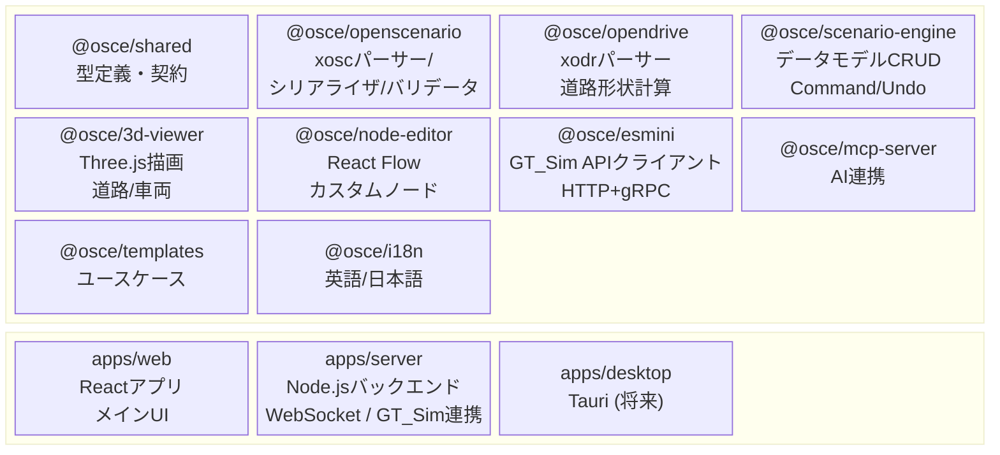
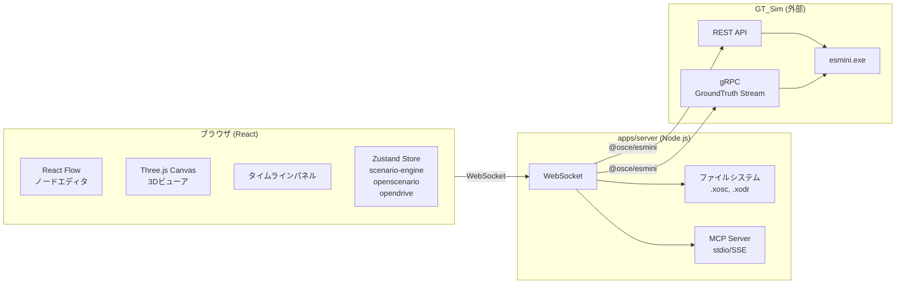
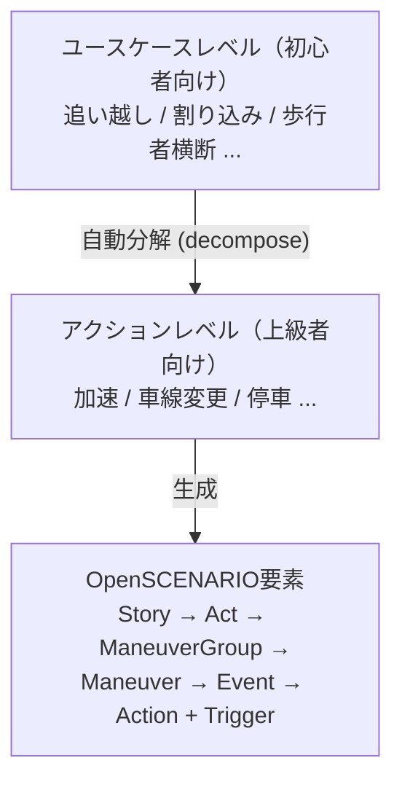
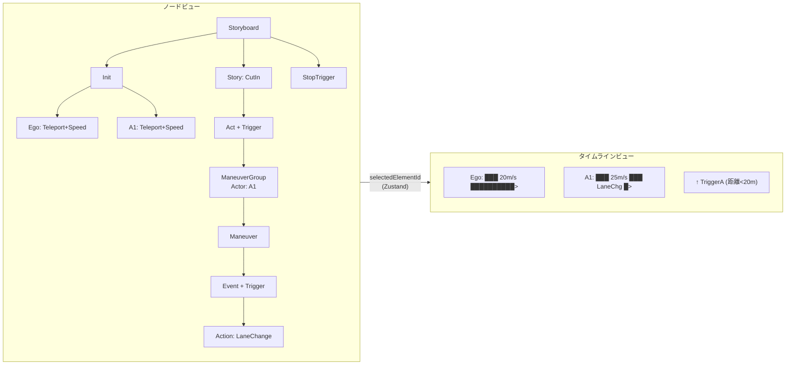
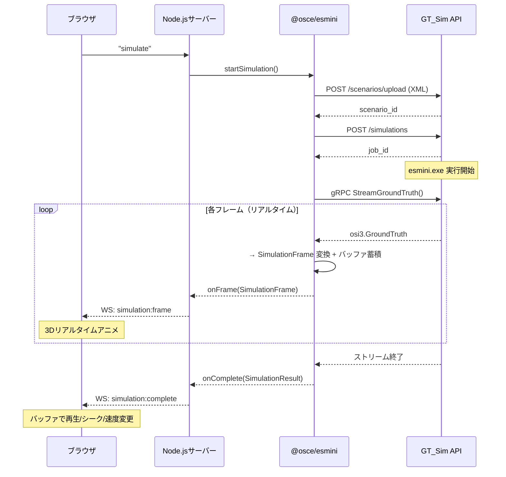
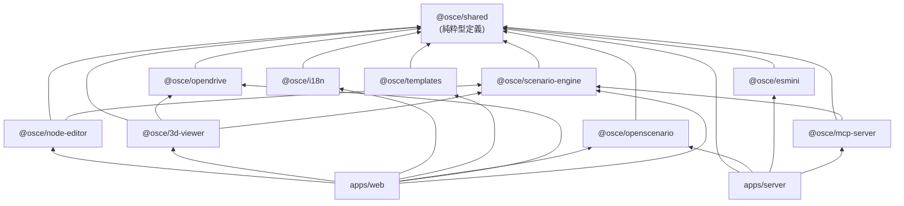

# ASAM OpenSCENARIO Editor - Architecture & Plan

## Context

ASAM OpenSCENARIO XML v1.2のシナリオを、Webブラウザ上でグラフィカルに作成・編集できるエディタを開発する。OpenSCENARIOに詳しくないユーザーでも直感的にシナリオを構築でき、AIエージェントとの協調作業も可能なツールを目指す。

**課題**: 既存のOpenSCENARIOエディタは少なく、XML手書きは非効率でエラーが起きやすい。Webベースでグラフィカルなものはほぼ存在しない。

**目標**: ノードベース+タイムラインのハイブリッド編集UI、3Dプレビュー、AIからの操作（MCP）、esminiリアルタイムプレビューを備えた総合エディタ。

---

## 技術スタック

| カテゴリ | 選定技術 |
|---------|---------|
| フロントエンド | React + TypeScript + Vite |
| バックエンド | Node.js + TypeScript (Fastify) |
| デスクトップ | Tauri（将来フェーズ） |
| 3D描画 | Three.js + React Three Fiber |
| ノードエディタ | React Flow (@xyflow/react v12) |
| UI | shadcn/ui + Tailwind CSS |
| 状態管理 | Zustand (React Flowと同じ選択) |
| テスト | Vitest (unit) + Playwright (E2E) |
| i18n | i18next + react-i18next (英語+日本語) |
| パッケージ管理 | pnpm workspaces (モノレポ) |
| XMLパース | fast-xml-parser |
| シミュレーション連携 | gRPC (@grpc/grpc-js) + protobufjs |
| 対象規格 | OpenSCENARIO XML v1.2 / OpenDRIVE v1.6 / ASAM OSI |

---

## アーキテクチャ



### 通信フロー



---

## パッケージ構成と責務

### `packages/shared` (@osce/shared) — 契約の中核
全パッケージが依存する型定義・インターフェース。**外部依存なし（純粋TypeScript型のみ）**

主要ファイル:
- `types/scenario.ts` — ScenarioDocument（ルートモデル）
- `types/entities.ts` — Vehicle, Pedestrian, MiscObject
- `types/storyboard.ts` — Story, Act, ManeuverGroup, Maneuver, Event
- `types/actions.ts` — 全アクション型（判別共用体）
- `types/triggers.ts` — Trigger, Condition, ConditionGroup
- `types/positions.ts` — 位置型（判別共用体）
- `types/opendrive.ts` — OpenDRIVE内部モデル
- `types/component-library.ts` — ユースケース/アクションコンポーネント型
- `interfaces/scenario-service.ts` — IScenarioService（CRUD操作）
- `interfaces/parser-service.ts` — IXoscParser, IXoscSerializer, IXodrParser
- `interfaces/command.ts` — ICommand（Undo/Redo）

### `packages/openscenario` (@osce/openscenario)
.xosc XML ↔ 内部モデル変換。スキーマバリデーション。
- 依存: `fast-xml-parser`, `@osce/shared`
- テストデータ: `Thirdparty/openscenario-v1.2.0/Examples/*.xosc`, `Thirdparty/esmini-demo_Windows/esmini-demo/resources/xosc/`

### `packages/opendrive` (@osce/opendrive)
.xodr XMLパース、道路形状計算（参照線、車線境界、標高）、Three.js用メッシュ生成。
- 依存: `fast-xml-parser`, `@osce/shared`
- テストデータ: `Thirdparty/esmini-demo_Windows/esmini-demo/resources/xodr/`

### `packages/scenario-engine` (@osce/scenario-engine)
コアビジネスロジック。Zustandストア、Commandパターン（Undo/Redo）、コンポーネントシステム、自動整合。
- 依存: `zustand`, `immer`, `uuid`, `@osce/shared`

### `packages/node-editor` (@osce/node-editor)
React Flowベースのノードエディタ + タイムラインビュー。
- 依存: `@xyflow/react`, `dagre`, `@osce/shared`, `@osce/scenario-engine`

### `packages/3d-viewer` (@osce/3d-viewer)
Three.jsによるOpenDRIVE道路描画 + シナリオエンティティ表示。
- 依存: `three`, `@react-three/fiber`, `@react-three/drei`, `@osce/shared`, `@osce/opendrive`, `@osce/scenario-engine`

### `packages/mcp-server` (@osce/mcp-server)
MCPプロトコルでエディタ操作を公開。AIエージェントからのシナリオ操作を可能に。
- 依存: `@modelcontextprotocol/sdk`, `@osce/shared`, `@osce/scenario-engine`

### `packages/esmini` (@osce/esmini)
GT_Sim API クライアント（HTTP + gRPC）。IEsminiService 実装。
- 依存: `@osce/shared`, `@grpc/grpc-js`, `protobufjs`（サーバーサイドのみ）
- REST API: シナリオアップロード、シミュレーション開始/停止/状態取得
- gRPC: OSI GroundTruth リアルタイムストリーミング → SimulationFrame 変換 + クライアント側バッファ
- 参照: `Thirdparty/open-simulation-interface/*.proto` (ASAM OSI proto定義)
- 参照: `docs/GT_SIM_API_REQUEST.md` (GT_Sim API追加リクエスト)

### `packages/templates` (@osce/templates)
ユースケース（割り込み、追い越し等）とアクションコンポーネントの定義。
- 依存: `@osce/shared`

### `packages/i18n` (@osce/i18n)
英語・日本語の翻訳リソース。
- 依存: `i18next`, `react-i18next`

### `apps/web` (@osce/web)
Reactメインアプリケーション。全パッケージを統合したエディタUI。

### `apps/server` (@osce/server)
Node.jsバックエンド。ファイルI/O、GT_Sim連携（@osce/esmini経由）、WebSocket通信。

---

## コア設計方針

### 1. 内部データモデル（AI-friendly JSON）

XMLではなくクリーンなJSON構造を内部表現とする。全要素にUUID `id`を付与し、安定した参照を実現。

```typescript
// ルート
interface ScenarioDocument {
  id: string;
  fileHeader: FileHeader;
  parameterDeclarations: ParameterDeclaration[];
  catalogLocations: CatalogLocations;
  roadNetwork: RoadNetwork;
  entities: ScenarioEntity[];
  storyboard: Storyboard;
  _editor: EditorMetadata;  // .xoscには出力しない
}

// アクションは判別共用体
type PrivateAction =
  | SpeedAction        // { type: 'speedAction', ... }
  | LaneChangeAction   // { type: 'laneChangeAction', ... }
  | TeleportAction     // { type: 'teleportAction', ... }
  | ...;

// 位置も判別共用体
type Position =
  | WorldPosition      // { type: 'worldPosition', x, y, z, h, p, r }
  | LanePosition       // { type: 'lanePosition', roadId, laneId, s, offset }
  | RelativeLanePosition
  | ...;
```

**設計理由**: 判別共用体はTypeScriptの型絞り込みが効き、AIにとっても自己記述的なJSON。switch文で網羅性チェックも可能。

### 2. 階層的コンポーネントシステム



- ユースケースは高レベルパラメータ（「割り込み距離」「速度差」等）を公開
- 内部的にStoryboard要素に分解される
- パラメータ変更時に **自動整合** (reconciler) が矛盾を解消
- 上級者はノードエディタで分解後の要素を直接編集可能
- パラメータは **グラフィカル表示** (visualHint: 'slider' | 'speedGauge' | 'distanceLine' 等)

### 3. ノードエディタ ↔ タイムラインの同期



Zustand selection storeで同期:
- ノードクリック → `selectedElementId` 更新 → タイムライン該当区間ハイライト + 3Dビューアでエンティティ選択
- タイムラインイベントクリック → ノードビューにスクロール + ハイライト

### 4. esmini連携（GT_Sim API + gRPC OSI ストリーミング）

別リポジトリの GT_Sim（改造esmini WebUI）と連携する。`@osce/esmini` はHTTP + gRPCクライアント。



- gRPC OSI GroundTruth をリアルタイム受信 → SimulationFrame 変換 → 3D ビューア表示
- 全フレームをクライアント側バッファに蓄積 → 完了後は再生・シーク・速度変更に使用
- gRPC は実行中のみストリーミング可能（実行後の再取得は不可）
- 詳細: `docs/GT_SIM_API_REQUEST.md`

### 5. MCPサーバー ツール定義（主要なもの）

| ツール名 | 説明 |
|---------|------|
| `create_scenario` | 新規シナリオ作成（テンプレート指定可） |
| `get_scenario_state` | 現在のシナリオをJSON取得 |
| `export_xosc` | OpenSCENARIO XML出力 |
| `add_entity` | エンティティ追加 |
| `add_speed_action` | 速度アクション追加 |
| `add_lane_change` | 車線変更アクション追加 |
| `apply_template` | ユースケーステンプレート適用 |
| `validate_scenario` | シナリオバリデーション |
| `load_road_network` | OpenDRIVE読み込み |
| `run_simulation` | esminiシミュレーション実行 |

---

## 開発フェーズ

### Phase 0: 基盤とコントラクト ✅ 完了
**全後続フェーズの前提条件。ここのインターフェース品質が全体を左右する。**

1. pnpmモノレポ初期化 (`pnpm-workspace.yaml`)
2. TypeScript設定（ルート + パッケージ別）
3. `packages/shared` に全型定義・インターフェース・enumを実装
4. 全パッケージのスタブ `package.json` を作成（依存関係定義）
5. ESLint + Prettier セットアップ
6. Vitest設定
7. 全パッケージが `@osce/shared` をimportしてビルドできることを確認

**成果物**: 全インターフェースが定義済み。各パッケージは独立して開発開始可能。

### Phase 1: コアエンジン + パーサー ✅ 完了（4並列開発）

| トラック | パッケージ | 主な作業 | テスト |
|---------|-----------|---------|--------|
| A | `@osce/openscenario` | XML↔モデル変換、ラウンドトリップテスト | 75合格 |
| B | `@osce/opendrive` | 道路パース、形状計算、メッシュ生成 | 64合格 |
| C | `@osce/scenario-engine` | Zustandストア、Command/Undo、コンポーネントシステム | 108合格 |
| D | `@osce/i18n` + `@osce/templates` | 翻訳(英日)、ユースケーステンプレート8種 | — |

**Phase 1 成果物:**
- `@osce/openscenario`: IXoscParser, IXoscSerializer, IValidator 実装。18種PrivateAction、6種GlobalAction、9種Position、14種Condition対応。Thirdparty 56ファイルのスモークテスト合格。
- `@osce/opendrive`: IXodrParser 実装。5種ジオメトリ（line, arc, spiral, poly3, paramPoly3）、車線境界計算、Three.js用メッシュ生成（Float32Array/Uint32Array）。
- `@osce/scenario-engine`: Zustand ストア + Immer。11種Commandクラス、Undo/Redo、CRUD操作、getElementById/getParentOfツリー探索、UseCaseComponent decompose/reconcile。
- `@osce/i18n`: i18next + react-i18next、6 namespace、600+翻訳キー（英日）。
- `@osce/templates`: 8ユースケース（CutIn, Overtaking, PedestrianCrossing, EmergencyBrake, FollowLeadVehicle, LaneChange, HighwayMerge, DecelerationToStop）、6アクションコンポーネント、visualHint対応。

### Phase 2: ビジュアルエディタ ✅ 完了（3並列開発）

| トラック | パッケージ | 主な作業 | テスト |
|---------|-----------|---------|--------|
| E | `@osce/node-editor` | カスタムノード、レイアウト、タイムライン、プロパティパネル | 49合格 |
| F | `@osce/3d-viewer` | 道路描画、車線表示、エンティティ、レーンID表示 | 36合格 |
| G | `apps/web` | メインレイアウト、ツールバー、パネル統合、ファイル操作 | 21合格 |

**Phase 2 成果物:**
- `@osce/node-editor`: React Flow v12ベース。11種カスタムノード（Storyboard, Init, Entity, Story, Act, ManeuverGroup, Maneuver, Event, Action, Trigger, Condition）、Dagre自動レイアウト（TB/LR方向）、タイムラインビュー（エンティティ別トラック+イベントマーカー）、7種プロパティエディタ、HierarchyEdge（実線）+TriggerEdge（破線）、MiniMap+Controls、scenario-engine双方向同期、ノード折りたたみ。scenario-engineにupdate系コマンド7種を追加（UpdateStory, UpdateAct, UpdateManeuverGroup, UpdateManeuver, UpdateEvent, UpdateAction, UpdateCondition）。
- `@osce/3d-viewer`: React Three Fiber + drei。OpenDRIVE道路描画（RoadNetwork, RoadMesh, LaneMesh, RoadMarkLine, RoadLabels）、エンティティ表示（Vehicle, Pedestrian, MiscObject + EntityLabel）、カメラコントロール、SceneEnvironment、viewer-store（Zustand）、シミュレーション再生（SimulationOverlay + useSimulationPlayback）、エンティティインタラクション、車線タイプ別色分け、位置解決ユーティリティ。
- `apps/web`: Vite 6 + React 19。react-resizable-panelsによる4パネルレイアウト（ノードエディタ/3Dビューア/サイドバー/タイムライン）、shadcn/ui 15コンポーネント + Tailwind v4テーマ、ツールバー（ファイル操作/Undo-Redo/バリデーション/言語切替/StatusBar）、@osce/scenario-engine Zustand統合（Context Provider）、@osce/i18n EN/JA切替、File System Access API + フォールバック、キーボードショートカット（Ctrl+Z/Y/S/O）、エンティティ管理パネル、テンプレートパレット（カテゴリ別+パラメータダイアログ）、プロパティパネル、バリデーションパネル、editor-store（localStorage永続化）。

**Phase 2 残課題 → Phase 4 Track K で解決済み ✅:**
- ~~apps/webの3d-viewer/node-editorプレースホルダーを実コンポーネントに統合~~
- ~~ドラッグ&ドロップ（テンプレートパレット → ノードエディタ）~~
- ~~コンテキストメニュー（右クリックでノード追加/削除）~~
- ~~Deleteキーによるノード削除ショートカット~~
- ~~明示的なError Boundaryコンポーネント~~

### Phase 3: バックエンド + 統合 + デザイン ✅ 完了（3並列開発 + デザイン修正）

| トラック | パッケージ | 主な作業 | テスト |
|---------|-----------|---------|--------|
| H | `apps/server` | Fastifyサーバー、WebSocket、ファイルI/O、GT_Sim連携ブリッジ | 37合格 |
| I | `@osce/esmini` | GT_Sim HTTPクライアント、gRPC OSIストリーミング、GroundTruth→SimulationFrame変換 | 36合格 |
| J | `@osce/mcp-server` | MCPツール実装、リソース/プロンプト定義 | 59合格 |
| — | `apps/web` (APEX v4) | デザインモックアップとの乖離修正 | — |

**Phase 3 成果物:**
- `apps/server`: Fastify + CORS + WebSocket。FileService（ファイルI/O）、ScenarioService（XOSC/XODRパース・シリアライズ）、SimulationService（シミュレーションライフサイクル）、MockEsminiService。REST 10エンドポイント（/api/files/open-xosc, save-xosc, open-xodr, browse, validate + /api/scenario/export-xml, import-xml + /api/simulation/start, stop, status）。WebSocketハンドラ。
- `@osce/esmini`: IEsminiService 実装。GtSimRestClient（シナリオアップロード、シミュレーション作成/状態取得）、GtSimGrpcClient（gRPC OSI GroundTruth ストリーミング）、GroundTruthConverter（OSI→SimulationFrame変換）。クライアント側フレームバッファリング。エラーリカバリ（REST失敗時のstatus復元）。dispose()によるリソース解放。Proto: `service_groundtruth.proto` (package `osi.server`)。
- `@osce/mcp-server`: MCP SDK準拠。51ツール（エンティティCRUD、アクション追加、ストーリーボード操作、テンプレート適用、Undo/Redo等）、2リソース（シナリオデータ、テンプレートカタログ）、2プロンプト（create_cut_in_scenario, create_scenario_from_description）。
- `apps/web` (APEX v4デザイン修正): モックアップ `design-apex-v4.html` に忠実なスタイリング修正。ヘッダー（50px高、ペンタゴンロゴ、グラデーションテキスト、グロウディバイダー）、ステータスバー（26px高、グロウライン、ステータスドット）、サイドバー（bg-deep背景）、タブ（Orbitron uppercase、アクセントグロウ下線）、ノードエディタ（28pxグリッド+放射状フェードマスク）、エントランスアニメーション、glass-itemシステム（カーソルリアクティブ hover/selected）、3pxカスタムスクロールバー。

### Phase 4: 統合 + ポリッシュ ✅ 完了

| トラック | 主な作業 | 状態 | プロンプト |
|---------|---------|------|-----------|
| K | コンポーネント統合 + UI強化 | ✅ 完了 | `docs/PHASE4_TRACK_K.md` |
| L | WebSocketクライアント + シミュレーション状態管理 | ✅ 完了 | `docs/PHASE4_TRACK_L.md` |
| M | Playwright E2E + 統合テスト + ポリッシュ | ✅ 完了 | `docs/PHASE4_TRACK_M.md` |

**Track K 成果物:**
- プレースホルダー差し替え: NodeEditorPlaceholder → `<NodeEditor>`（React Flow）、ViewerPlaceholder → `<ScenarioViewer>`（Three.js）、TimelinePlaceholder → `<TimelineView>`
- NodeEditorProvider によるストア分離（node-editor内部store vs apps/web editor-store）
- 選択同期: NodeEditor ↔ ScenarioViewer ↔ PropertyPanel（useEditorStore経由）
- Error Boundary: パネル別（NodeEditor, Viewer, Timeline）のクラスコンポーネント、APEXスタイリング
- ドラッグ&ドロップ: TemplateCard → NodeEditor領域（useTemplateDrop hook、ParameterDialog連携）
- コンテキストメニュー: ノードエディタ内の右クリック（空白領域: エンティティ/ストーリー追加、ノード上: 削除）
- Delete/Backspaceキーによる要素削除（useElementDelete hook、detectElementType）
- NodeEditor拡張props（onDrop, onDragOver, onPaneContextMenu, onNodeContextMenu, deleteKeyCode, disableBuiltinShortcuts）
- 共有ユーティリティ: `lib/dom-utils.ts`（isInputFocused）

**Track L 成果物:**
- WebSocketクライアント: `use-websocket.ts`（自動再接続・指数バックオフ・ハートビート30秒・型安全send）
- サーバー接続API: `use-server-connection.ts`（openFile, saveFile, startSimulation, stopSimulation）+ `ServerConnectionProvider`（React Context）
- シミュレーション状態ストア: `simulation-store.ts`（Zustand、status/frames/playback、requestAnimationFrameベース再生、シーク、速度変更0.25x〜4x）
- ツールバー統合: `SimulationButtons.tsx`（Run/Stop）、StatusBar WebSocket接続状態表示（connecting/connected/disconnected/error）
- 再生UI: `SimulationTimeline.tsx`（Play/Pause、シークバー、速度セレクタ、フレームカウンタ）
- WebSocket メッセージ型: `types/ws-messages.ts`（サーバー側と完全一致）
- i18n: シミュレーション操作・接続状態の翻訳キー追加（en/ja）
- トースト通知: sonner + APEXグラススタイリング（ファイル操作結果、エラー通知）
- File System Access API フォールバック（サーバー未接続時）

**Track M 成果物:**
- Playwright E2Eテストインフラ: `playwright.config.ts`（デュアルwebServer: バックエンド+フロントエンド）、`global-setup.ts`（teardown関数パターン）
- Mock E2Eスペック6種: app-startup, entity-crud, template-apply, file-operations, i18n, validation
- GT_Sim統合E2Eスペック3種: gt-sim-connection, gt-sim-simulation, gt-sim-upload（`GT_SIM_URL`環境変数による条件分岐）
- アクセシビリティ: ARIA roles/aria-labels/data-testid を8コンポーネントに追加（StatusBar, EntityListItem, HeaderToolbar, SimulationTimeline等）
- ラウンドトリップテスト拡張: OpenSCENARIO v1.2.0全16サンプル + GT_Sim 10シナリオ対応
- サーバー側: `GtSimService`/`MockEsminiService` の`GT_SIM_URL`環境変数による動的切替
- `vitest.config.ts`: e2e/および.claude/をユニットテスト対象から除外
- `cross-env`導入（Windows互換テストスクリプト）
- レビュー10件対応（globalSetup修正、role="status"スコープ縮小、waitForTimeout排除、正規表現修正等）

### Phase 5: 成熟度管理 ✅ 完了

| トラック | 主な作業 | 状態 |
|---------|---------|------|
| maturity-track-a | 能力マトリクスシステム | ✅ 完了 |

**成果物:**
- 能力マトリクスシステム: 11ドメイン（core, 3d, backend, devops, i18n, mcp, opendrive, qa, sim, templates, ux）のJSON定義（`docs/maturity/capabilities/*.json`）
- マトリクス自動生成: `scripts/maturity/generate-matrix.mjs` → `docs/maturity/matrix.json` + `docs/maturity/matrix.md`
- JSONスキーマバリデーション: `docs/maturity/schema/capability.schema.json` + `scripts/maturity/validate-capabilities.mjs`
- ブラウザビューア: `docs/maturity/viewer.html`（`scripts/maturity/serve-viewer.mjs`で起動）
- ガバナンス: `docs/maturity/GOVERNANCE.md`（運用ルール）、`docs/maturity/README.md`（概要）

### 将来フェーズ
- Tauriデスクトップアプリ (`apps/desktop`)
- OpenSCENARIO v2.0 DSL対応
- リアルタイムコラボレーション
- OpenDRIVEエディタ機能
- テンプレート追加

---

## 並列開発戦略（コントラクトファースト）

**核心**: `packages/shared` が全パッケージ間の「契約」。Phase 0で確定し、以降は変更しない（やむを得ない場合はオーケストレーターが調整）。

各Claude Codeインスタンスのルール:
1. `packages/shared/src/` を熟読 — これが契約
2. 自パッケージの `CLAUDE_INSTRUCTIONS.md` に従う
3. `packages/shared` は **絶対に変更しない**（型変更が必要なら報告）
4. 他パッケージの実装ではなくインターフェースに対してコーディング
5. モックデータで包括的なテストを書く
6. `Thirdparty/` のサンプルファイルを統合テストに使用
7. `src/index.ts` でクリーンな公開APIをエクスポート

---

## 重要な参照ファイル

| ファイル | 用途 |
|---------|------|
| `Thirdparty/openscenario-v1.2.0/Schema/OpenSCENARIO.xsd` | 全OpenSCENARIO型の権威的ソース |
| `Thirdparty/openscenario-v1.2.0/Examples/CutIn.xosc` | パーサーラウンドトリップテスト用 |
| `Thirdparty/opendrive/xsd_schema/opendrive_16_*.xsd` | OpenDRIVE型のソース |
| `Thirdparty/open-simulation-interface/*.proto` | ASAM OSI proto定義（gRPC連携用） |
| `Thirdparty/esmini-demo_Windows/esmini-demo/resources/xosc/` | テスト用シナリオ群 |
| `Thirdparty/esmini-demo_Windows/esmini-demo/resources/xodr/` | テスト用道路データ群 |
| `docs/GT_SIM_API_REQUEST.md` | GT_Sim API追加リクエスト仕様 |

---

## 検証方法

1. **ユニットテスト**: `pnpm test` — 全パッケージのVitestテスト実行
2. **型チェック**: `pnpm typecheck` — TypeScript型整合性の確認
3. **ラウンドトリップ**: サンプル.xoscを読み込み → 内部モデル → .xosc書き出し → 内容比較
4. **3Dビューア**: サンプル.xodrを読み込み → ブラウザで道路が正しく描画されるか確認
5. **ノードエディタ**: サンプル.xoscを読み込み → ノードが正しく配置されるか確認
6. **MCP**: Claude等のMCPクライアントからツールを呼び出してシナリオ操作
7. **esmini**: サンプルシナリオを実行 → gRPC受信 → 3Dビューアでアニメーション再生
8. **E2Eテスト**: `pnpm test:e2e` — Playwrightによるブラウザ操作テスト
9. **テンプレート**: 各ユースケーステンプレートを適用 → 生成された.xoscをesminiで実行可能か確認

---

## パッケージ依存グラフ


