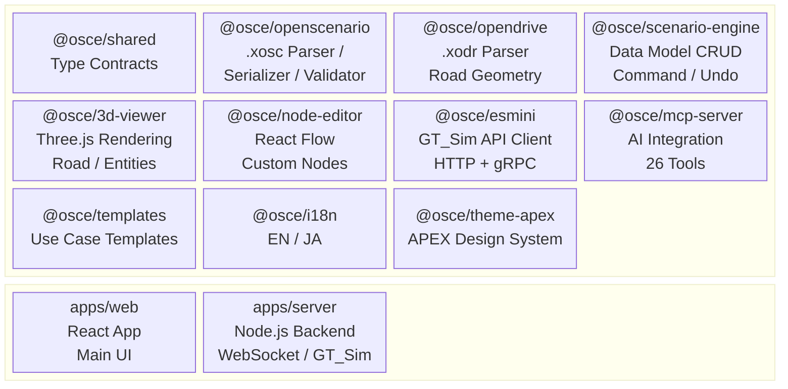
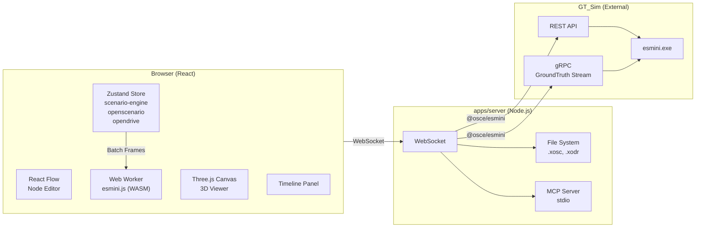
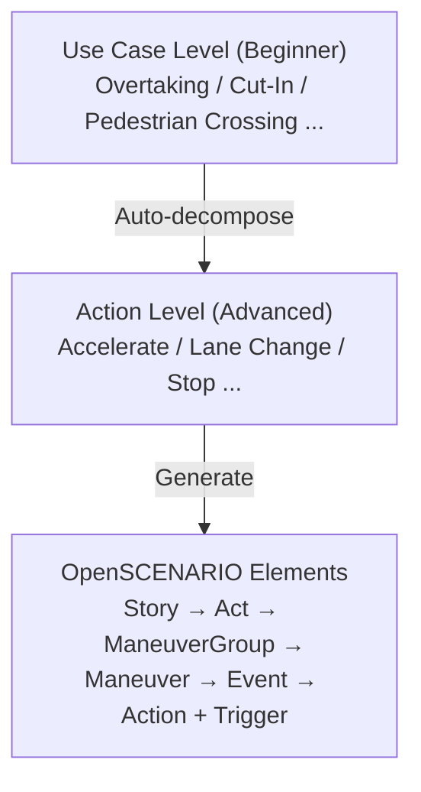
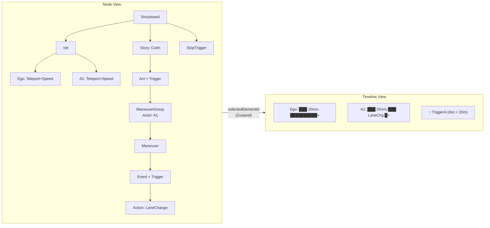
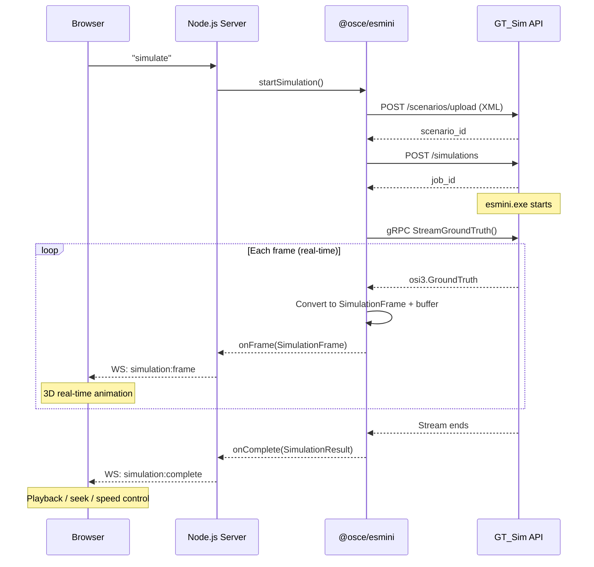
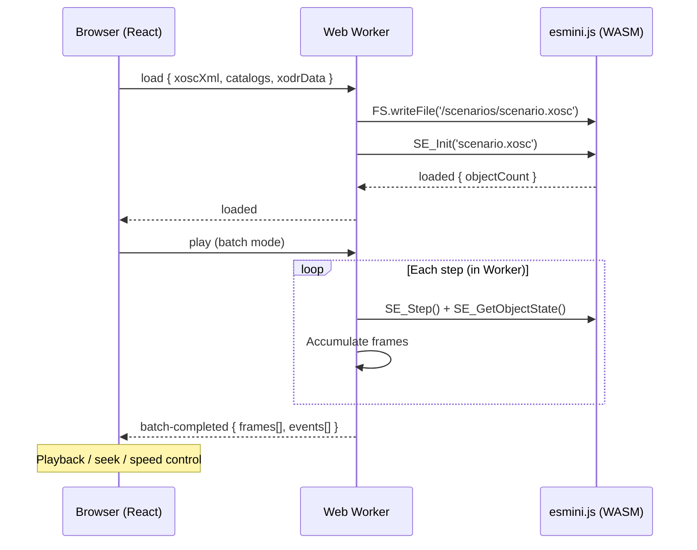
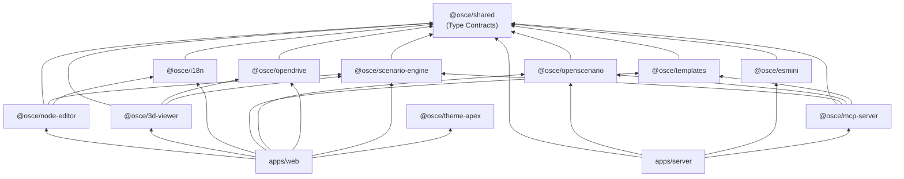

# ASAM OpenSCENARIO Editor — アーキテクチャ

> 技術スタック・設計思想・通信フロー・パッケージ責務を記載。
> セットアップや起動手順は [DEVELOPMENT.md](./DEVELOPMENT.md)、コーディング規約は [CLAUDE.md](../CLAUDE.md) を参照。

## Context

ASAM OpenSCENARIO XML v1.2のシナリオを、Webブラウザ上でグラフィカルに作成・編集できるエディタ。OpenSCENARIOに詳しくないユーザーでも直感的にシナリオを構築でき、AIエージェントとの協調作業も可能なツールを目指す。

**課題**: 既存のOpenSCENARIOエディタは少なく、XML手書きは非効率でエラーが起きやすい。Webベースでグラフィカルなものはほぼ存在しない。

**目標**: ノードベース+タイムラインのハイブリッド編集UI、3Dプレビュー、AIからの操作（MCP）、esminiシミュレーション（GT_Sim gRPC + ブラウザ内WASM）を備えた総合エディタ。

---

## 技術スタック

| カテゴリ | 選定技術 |
|---------|---------|
| フロントエンド | React 19 + TypeScript + Vite 6 |
| バックエンド | Node.js + TypeScript (Fastify) |
| 3D描画 | Three.js + React Three Fiber |
| ノードエディタ | React Flow (@xyflow/react v12) |
| UI | shadcn/ui + Tailwind CSS 4 |
| デザインシステム | @osce/theme-apex (APEX: Orbitron, glass-effect) |
| 状態管理 | Zustand |
| テスト | Vitest (unit) + Playwright (E2E) |
| i18n | i18next + react-i18next (英語+日本語) |
| パッケージ管理 | pnpm workspaces (モノレポ) |
| XMLパース | fast-xml-parser |
| シミュレーション | gRPC (@grpc/grpc-js) + Emscripten WASM |
| 対象規格 | OpenSCENARIO XML v1.2 / OpenDRIVE v1.6 / ASAM OSI |

---

## アーキテクチャ


```mermaid
block-beta
  columns 4

  block:packages:4
    columns 4
    shared["@osce/shared\nType Contracts"]
    openscenario["@osce/openscenario\n.xosc Parser /\nSerializer / Validator"]
    opendrive["@osce/opendrive\n.xodr Parser\nRoad Geometry"]
    engine["@osce/scenario-engine\nData Model CRUD\nCommand / Undo"]

    viewer["@osce/3d-viewer\nThree.js Rendering\nRoad / Entities"]
    nodeeditor["@osce/node-editor\nReact Flow\nCustom Nodes"]
    esmini["@osce/esmini\nGT_Sim API Client\nHTTP + gRPC"]
    mcp["@osce/mcp-server\nAI Integration\n26 Tools"]

    templates["@osce/templates\nUse Case Templates"]
    i18n["@osce/i18n\nEN / JA"]
    themeapex["@osce/theme-apex\nAPEX Design System"]
    space
  end

  block:apps:4
    columns 4
    web["apps/web\nReact App\nMain UI"]
    server["apps/server\nNode.js Backend\nWebSocket / GT_Sim"]
    space:2
  end
```

### 通信フロー


```mermaid
graph LR
  subgraph Browser["Browser (React)"]
    RF["React Flow\nNode Editor"]
    R3F["Three.js Canvas\n3D Viewer"]
    TL["Timeline Panel"]
    Store["Zustand Store\nscenario-engine\nopenscenario\nopendrive"]
    WASM["Web Worker\nesmini.js (WASM)"]
  end

  subgraph Server["apps/server (Node.js)"]
    WS["WebSocket"]
    FS["File System\n.xosc, .xodr"]
    MCP["MCP Server\nstdio"]
  end

  subgraph GTSim["GT_Sim (External)"]
    REST["REST API"]
    GRPC["gRPC\nGroundTruth Stream"]
    ESMINI["esmini.exe"]
  end

  Store -- "Batch Frames" --> WASM
  Browser -- "WebSocket" --> WS
  WS --> FS
  WS --> MCP
  WS -- "@osce/esmini" --> REST
  WS -- "@osce/esmini" --> GRPC
  REST --> ESMINI
  GRPC --> ESMINI
```

---

## パッケージ構成と責務

### `packages/shared` (@osce/shared) — 契約の中核
全パッケージが依存する型定義・インターフェース。**外部依存なし（純粋TypeScript型のみ）**

主要ファイル:
- `types/scenario.ts` — ScenarioDocument（ルートモデル）
- `types/entities.ts` — Vehicle, Pedestrian, MiscObject
- `types/storyboard.ts` — Story, Act, ManeuverGroup, Maneuver, Event
- `types/actions.ts` — 全アクション型（判別共用体）
- `types/triggers.ts` — Trigger, Condition, ConditionGroup
- `types/positions.ts` — 位置型（判別共用体）
- `types/opendrive.ts` — OpenDRIVE内部モデル
- `types/component-library.ts` — ユースケース/アクションコンポーネント型
- `interfaces/scenario-service.ts` — IScenarioService（CRUD操作）
- `interfaces/parser-service.ts` — IXoscParser, IXoscSerializer, IXodrParser
- `interfaces/command.ts` — ICommand（Undo/Redo）

### `packages/openscenario` (@osce/openscenario)
.xosc XML ↔ 内部モデル変換。スキーマバリデーション。
- 依存: `fast-xml-parser`, `@osce/shared`
- テストデータ: `Thirdparty/openscenario-v1.2.0/Examples/*.xosc`, `Thirdparty/esmini-demo_Windows/esmini-demo/resources/xosc/`

### `packages/opendrive` (@osce/opendrive)
.xodr XMLパース、道路形状計算（参照線、車線境界、標高）、Three.js用メッシュ生成。
- 依存: `fast-xml-parser`, `@osce/shared`
- テストデータ: `Thirdparty/esmini-demo_Windows/esmini-demo/resources/xodr/`

### `packages/scenario-engine` (@osce/scenario-engine)
コアビジネスロジック。Zustandストア、Commandパターン（Undo/Redo）、コンポーネントシステム、自動整合。
- 依存: `zustand`, `immer`, `uuid`, `@osce/shared`

### `packages/node-editor` (@osce/node-editor)
React Flowベースのノードエディタ + タイムラインビュー。
- 依存: `@xyflow/react`, `@dagrejs/dagre`, `@osce/shared`, `@osce/scenario-engine`, `@osce/i18n`

### `packages/3d-viewer` (@osce/3d-viewer)
Three.jsによるOpenDRIVE道路描画 + シナリオエンティティ表示 + シミュレーション再生。
- 依存: `three`, `@react-three/fiber`, `@react-three/drei`, `@osce/shared`, `@osce/opendrive`, `@osce/scenario-engine`

### `packages/esmini` (@osce/esmini)
GT_Sim API クライアント（HTTP + gRPC）。IEsminiService 実装。サーバーサイドのみ。
- 依存: `@osce/shared`, `@grpc/grpc-js`, `protobufjs`
- REST API: シナリオアップロード、シミュレーション開始/停止/状態取得
- gRPC: OSI GroundTruth リアルタイムストリーミング → SimulationFrame 変換 + クライアント側バッファ
- 参照: `Thirdparty/open-simulation-interface/*.proto` (ASAM OSI proto定義)

### `packages/mcp-server` (@osce/mcp-server)
MCPプロトコルでエディタ操作を公開。AIエージェントからのシナリオ操作を可能に。
- 依存: `@modelcontextprotocol/sdk`, `@osce/shared`, `@osce/scenario-engine`, `@osce/openscenario`, `@osce/templates`
- 26ツール、2リソース、2プロンプト

### `packages/templates` (@osce/templates)
ユースケース（割り込み、追い越し等）とアクションコンポーネントの定義。
- 依存: `@osce/shared`
- 8ユースケース、6アクションコンポーネント

### `packages/i18n` (@osce/i18n)
英語・日本語の翻訳リソース。
- 依存: `i18next`, `react-i18next`

### `packages/theme-apex` (@osce/theme-apex)
APEXデザインシステム。ガラスエフェクト、カーソルライティング、フォント設定。
- 依存: `@fontsource/orbitron`, `@fontsource/exo-2`, `@fontsource/m-plus-1p`, `@fontsource/jetbrains-mono`, `clsx`, `tailwind-merge`
- エクスポート: `CursorLight`, `GlassPanel` コンポーネント、`useCursorLight` フック、`apex.css`

### `apps/web` (@osce/web)
Reactメインアプリケーション。全パッケージを統合したエディタUI。WASM esminiシミュレーションもここで実行。

### `apps/server` (@osce/server)
Node.jsバックエンド。ファイルI/O、GT_Sim連携（@osce/esmini経由）、WebSocket通信。

---

## コア設計方針

### 1. 内部データモデル（AI-friendly JSON）

XMLではなくクリーンなJSON構造を内部表現とする。全要素にUUID `id`を付与し、安定した参照を実現。

```typescript
// ルート
interface ScenarioDocument {
  id: string;
  fileHeader: FileHeader;
  parameterDeclarations: ParameterDeclaration[];
  catalogLocations: CatalogLocations;
  roadNetwork: RoadNetwork;
  entities: ScenarioEntity[];
  storyboard: Storyboard;
  _editor: EditorMetadata;  // .xoscには出力しない
}

// アクションは判別共用体
type PrivateAction =
  | SpeedAction        // { type: 'speedAction', ... }
  | LaneChangeAction   // { type: 'laneChangeAction', ... }
  | TeleportAction     // { type: 'teleportAction', ... }
  | ...;

// 位置も判別共用体
type Position =
  | WorldPosition      // { type: 'worldPosition', x, y, z, h, p, r }
  | LanePosition       // { type: 'lanePosition', roadId, laneId, s, offset }
  | RelativeLanePosition
  | ...;
```

**設計理由**: 判別共用体はTypeScriptの型絞り込みが効き、AIにとっても自己記述的なJSON。switch文で網羅性チェックも可能。

### 2. 階層的コンポーネントシステム


```mermaid
graph TD
  UC["Use Case Level (Beginner)\nOvertaking / Cut-In / Pedestrian Crossing ..."]
  AC["Action Level (Advanced)\nAccelerate / Lane Change / Stop ..."]
  OSC["OpenSCENARIO Elements\nStory → Act → ManeuverGroup →\nManeuver → Event → Action + Trigger"]

  UC -- "Auto-decompose" --> AC
  AC -- "Generate" --> OSC
```

- ユースケースは高レベルパラメータ（「割り込み距離」「速度差」等）を公開
- 内部的にStoryboard要素に分解される
- パラメータ変更時に **自動整合** (reconciler) が矛盾を解消
- 上級者はノードエディタで分解後の要素を直接編集可能
- パラメータは **グラフィカル表示** (visualHint: 'slider' | 'speedGauge' | 'distanceLine' 等)

### 3. ノードエディタ ↔ タイムラインの同期


```mermaid
graph LR
  subgraph NodeView["Node View"]
    SB["Storyboard"]
    Init["Init"]
    EgoInit["Ego: Teleport+Speed"]
    A1Init["A1: Teleport+Speed"]
    Story["Story: CutIn"]
    Act["Act + Trigger"]
    MG["ManeuverGroup\nActor: A1"]
    Mnv["Maneuver"]
    Evt["Event + Trigger"]
    LCA["Action: LaneChange"]
    Stop["StopTrigger"]

    SB --> Init
    SB --> Story
    SB --> Stop
    Init --> EgoInit
    Init --> A1Init
    Story --> Act
    Act --> MG
    MG --> Mnv
    Mnv --> Evt
    Evt --> LCA
  end

  subgraph TimelineView["Timeline View"]
    EgoTrack["Ego: ███ 20m/s ██████████>"]
    A1Track["A1: ███ 25m/s ███ LaneChg █>"]
    TrigA["↑ TriggerA (dist < 20m)"]
  end

  NodeView -- "selectedElementId\n(Zustand)" --> TimelineView
```

Zustand selection storeで同期:
- ノードクリック → `selectedElementId` 更新 → タイムライン該当区間ハイライト + 3Dビューアでエンティティ選択
- タイムラインイベントクリック → ノードビューにスクロール + ハイライト

### 4. シミュレーション連携（2モード）

シミュレーションは **GT_Sim（サーバー経由）** と **WASM（ブラウザ内）** の2モードで動作する。

#### モードA: GT_Sim (gRPC OSI ストリーミング)

GT_Sim（改造esmini WebUI）と連携。バックエンド必須。リアルタイムフレーム配信。


```mermaid
sequenceDiagram
  participant B as Browser
  participant S as Node.js Server
  participant E as @osce/esmini
  participant G as GT_Sim API

  B->>S: "simulate"
  S->>E: startSimulation()
  E->>G: POST /scenarios/upload (XML)
  G-->>E: scenario_id
  E->>G: POST /simulations
  G-->>E: job_id
  Note over G: esmini.exe starts
  E->>G: gRPC StreamGroundTruth()

  loop Each frame (real-time)
    G-->>E: osi3.GroundTruth
    E->>E: Convert to SimulationFrame + buffer
    E-->>S: onFrame(SimulationFrame)
    S-->>B: WS: simulation:frame
    Note over B: 3D real-time animation
  end

  G-->>E: Stream ends
  E-->>S: onComplete(SimulationResult)
  S-->>B: WS: simulation:complete
  Note over B: Playback / seek / speed control
```

GT_Simアーキテクチャ:
```
gt_sim_web.exe (port 8000)     ← REST API + gRPC + Web UI
    └── bin/GT_Sim.exe         ← Simulation engine (subprocess)

API Flow:
  POST /api/scenarios/upload (XML)  →  scenario_id
  POST /api/simulations             →  job_id + GT_Sim.exe starts
  gRPC StreamGroundTruth()           →  OSI frame stream
  WebSocket /ws/osi/{job_id}         →  JSON stream for browser
```

#### モードB: WASM (ブラウザ内実行)

esminiをEmscriptenでWASMコンパイルし、Web Workerで実行。バックエンド不要。


```mermaid
sequenceDiagram
  participant UI as Browser (React)
  participant W as Web Worker
  participant E as esmini.js (WASM)

  UI->>W: load { xoscXml, catalogs, xodrData }
  W->>E: FS.writeFile('/scenarios/scenario.xosc')
  W->>E: SE_Init('scenario.xosc')
  E-->>W: loaded { objectCount }
  W-->>UI: loaded

  UI->>W: play (batch mode)
  loop Each step (in Worker)
    W->>E: SE_Step() + SE_GetObjectState()
    W->>W: Accumulate frames
  end
  W-->>UI: batch-completed { frames[], events[] }
  Note over UI: Playback / seek / speed control
```

- WASMファイル: `apps/web/public/wasm/esmini.js`（Emscripten SINGLE_FILE、4.8MB）
- Emscripten仮想FSにシナリオXML・カタログ・道路データを書き込んでからesminiを初期化
- バッチモード: 全フレームをWorker内で蓄積し、完了後に一括送信（メインスレッド負荷を回避）
- 最大シミュレーション時間: 120秒

### 5. MCPサーバー ツール定義（26ツール）

| カテゴリ | ツール数 | 主なツール |
|---------|---------|---------|
| Entity | 4 | `add_entity`, `remove_entity`, `list_entities`, `update_entity` |
| Init | 2 | `set_init_position`, `set_init_speed` |
| Action | 4 | `add_speed_action`, `add_lane_change_action`, `add_teleport_action`, `add_action` |
| Storyboard | 4 | `add_story`, `add_act`, `add_maneuver_group`, `add_event` |
| Scenario | 5 | `create_scenario`, `get_scenario_state`, `export_xosc`, `import_xosc`, `validate_scenario` |
| Trigger | 3 | `set_start_trigger`, `add_simulation_time_trigger`, `add_distance_trigger` |
| Template | 2 | `list_templates`, `apply_template` |
| Undo/Redo | 2 | `undo`, `redo` |

加えて 2リソース（シナリオデータ、テンプレートカタログ）、2プロンプト（`create_cut_in_scenario`, `create_scenario_from_description`）。

---

## 並列開発戦略

**核心**: `packages/shared` が全パッケージ間の「契約」。パッケージ境界で責務を分離し、インターフェースに対してコーディングする。

- `@osce/shared` の型変更は全パッケージに影響するため、単独PRで慎重に行う
- 異なるパッケージ（例: `@osce/node-editor` + `@osce/3d-viewer`）は安全に並列開発可能
- 詳細なワークフロールールは [CLAUDE.md](../CLAUDE.md) を参照

---

## ロードマップ

- OpenSCENARIO v2.0 DSL対応
- リアルタイムコラボレーション
- OpenDRIVEエディタ機能
- テンプレート追加

---

## 重要な参照ファイル

| ファイル | 用途 |
|---------|------|
| `Thirdparty/openscenario-v1.2.0/Schema/OpenSCENARIO.xsd` | 全OpenSCENARIO型の権威的ソース |
| `Thirdparty/openscenario-v1.2.0/Examples/CutIn.xosc` | パーサーラウンドトリップテスト用 |
| `Thirdparty/opendrive/xsd_schema/opendrive_16_*.xsd` | OpenDRIVE型のソース |
| `Thirdparty/open-simulation-interface/*.proto` | ASAM OSI proto定義（gRPC連携用） |
| `Thirdparty/esmini-demo_Windows/esmini-demo/resources/xosc/` | テスト用シナリオ群 |
| `Thirdparty/esmini-demo_Windows/esmini-demo/resources/xodr/` | テスト用道路データ群 |

---

## 検証方法

1. **ユニットテスト**: `pnpm test` — 全パッケージのVitestテスト実行
2. **型チェック**: `pnpm typecheck` — TypeScript型整合性の確認
3. **ラウンドトリップ**: サンプル.xoscを読み込み → 内部モデル → .xosc書き出し → 内容比較
4. **3Dビューア**: サンプル.xodrを読み込み → ブラウザで道路が正しく描画されるか確認
5. **ノードエディタ**: サンプル.xoscを読み込み → ノードが正しく配置されるか確認
6. **MCP**: Claude等のMCPクライアントからツールを呼び出してシナリオ操作
7. **WASMシミュレーション**: サンプルシナリオをUIから実行 → 3Dビューアで再生
8. **GT_Simシミュレーション**: サンプルシナリオを実行 → gRPC受信 → 3Dビューアでアニメーション再生
9. **E2Eテスト**: `pnpm test:e2e` — Playwrightによるブラウザ操作テスト
10. **テンプレート**: 各ユースケーステンプレートを適用 → 生成された.xoscをesminiで実行可能か確認

---

## パッケージ依存グラフ


```mermaid
graph BT
  shared["@osce/shared\n(Type Contracts)"]

  openscenario["@osce/openscenario"] --> shared
  opendrive["@osce/opendrive"] --> shared
  engine["@osce/scenario-engine"] --> shared
  i18n["@osce/i18n"] --> shared
  templates["@osce/templates"] --> shared
  esmini["@osce/esmini"] --> shared
  themeapex["@osce/theme-apex"]

  nodeeditor["@osce/node-editor"] --> shared
  nodeeditor --> engine
  nodeeditor --> i18n
  viewer["@osce/3d-viewer"] --> shared
  viewer --> opendrive
  viewer --> engine
  mcp["@osce/mcp-server"] --> shared
  mcp --> engine
  mcp --> openscenario
  mcp --> templates

  web["apps/web"] --> nodeeditor
  web --> viewer
  web --> i18n
  web --> templates
  web --> openscenario
  web --> opendrive
  web --> engine
  web --> themeapex

  server["apps/server"] --> shared
  server --> openscenario
  server --> esmini
  server --> mcp
```
