# ASAM OpenSCENARIO Editor - Architecture & Plan

## Context

ASAM OpenSCENARIO XML v1.2のシナリオを、Webブラウザ上でグラフィカルに作成・編集できるエディタを開発する。OpenSCENARIOに詳しくないユーザーでも直感的にシナリオを構築でき、AIエージェントとの協調作業も可能なツールを目指す。

**課題**: 既存のOpenSCENARIOエディタは少なく、XML手書きは非効率でエラーが起きやすい。Webベースでグラフィカルなものはほぼ存在しない。

**目標**: ノードベース+タイムラインのハイブリッド編集UI、3Dプレビュー、AIからの操作（MCP）、esminiリアルタイムプレビューを備えた総合エディタ。

---

## 技術スタック

| カテゴリ | 選定技術 |
|---------|---------|
| フロントエンド | React + TypeScript + Vite |
| バックエンド | Node.js + TypeScript (Fastify) |
| デスクトップ | Tauri（将来フェーズ） |
| 3D描画 | Three.js + React Three Fiber |
| ノードエディタ | React Flow (@xyflow/react v12) |
| UI | shadcn/ui + Tailwind CSS |
| 状態管理 | Zustand (React Flowと同じ選択) |
| テスト | Vitest (unit) + Playwright (E2E) |
| i18n | i18next + react-i18next (英語+日本語) |
| パッケージ管理 | pnpm workspaces (モノレポ) |
| XMLパース | fast-xml-parser |
| シミュレーション連携 | gRPC (@grpc/grpc-js) + protobufjs |
| 対象規格 | OpenSCENARIO XML v1.2 / OpenDRIVE v1.6 / ASAM OSI |

---

## アーキテクチャ

```mermaid
block-beta
  columns 4

  block:packages:4
    columns 4
    shared["@osce/shared\n型定義・契約"]
    openscenario["@osce/openscenario\nxoscパーサー/\nシリアライザ/バリデータ"]
    opendrive["@osce/opendrive\nxodrパーサー\n道路形状計算"]
    engine["@osce/scenario-engine\nデータモデルCRUD\nCommand/Undo"]

    viewer["@osce/3d-viewer\nThree.js描画\n道路/車両"]
    nodeeditor["@osce/node-editor\nReact Flow\nカスタムノード"]
    esmini["@osce/esmini\nGT_Sim APIクライアント\nHTTP+gRPC"]
    mcp["@osce/mcp-server\nAI連携"]

    templates["@osce/templates\nユースケース"]
    i18n["@osce/i18n\n英語/日本語"]
    space:2
  end

  block:apps:4
    columns 4
    web["apps/web\nReactアプリ\nメインUI"]
    server["apps/server\nNode.jsバックエンド\nWebSocket / GT_Sim連携"]
    desktop["apps/desktop\nTauri (将来)"]
    space
  end
```



### 通信フロー

```mermaid
graph LR
  subgraph Browser["ブラウザ (React)"]
    RF["React Flow\nノードエディタ"]
    R3F["Three.js Canvas\n3Dビューア"]
    TL["タイムラインパネル"]
    Store["Zustand Store\nscenario-engine\nopenscenario\nopendrive"]
  end

  subgraph Server["apps/server (Node.js)"]
    WS["WebSocket"]
    FS["ファイルシステム\n.xosc, .xodr"]
    MCP["MCP Server\nstdio/SSE"]
  end

  subgraph GTSim["GT_Sim (外部)"]
    REST["REST API"]
    GRPC["gRPC\nGroundTruth Stream"]
    ESMINI["esmini.exe"]
  end

  Browser -- WebSocket --> WS
  WS --> FS
  WS --> MCP
  WS -- "@osce/esmini" --> REST
  WS -- "@osce/esmini" --> GRPC
  REST --> ESMINI
  GRPC --> ESMINI
```



---

## パッケージ構成と責務

### `packages/shared` (@osce/shared) — 契約の中核
全パッケージが依存する型定義・インターフェース。**外部依存なし（純粋TypeScript型のみ）**

主要ファイル:
- `types/scenario.ts` — ScenarioDocument（ルートモデル）
- `types/entities.ts` — Vehicle, Pedestrian, MiscObject
- `types/storyboard.ts` — Story, Act, ManeuverGroup, Maneuver, Event
- `types/actions.ts` — 全アクション型（判別共用体）
- `types/triggers.ts` — Trigger, Condition, ConditionGroup
- `types/positions.ts` — 位置型（判別共用体）
- `types/opendrive.ts` — OpenDRIVE内部モデル
- `types/component-library.ts` — ユースケース/アクションコンポーネント型
- `interfaces/scenario-service.ts` — IScenarioService（CRUD操作）
- `interfaces/parser-service.ts` — IXoscParser, IXoscSerializer, IXodrParser
- `interfaces/command.ts` — ICommand（Undo/Redo）

### `packages/openscenario` (@osce/openscenario)
.xosc XML ↔ 内部モデル変換。スキーマバリデーション。
- 依存: `fast-xml-parser`, `@osce/shared`
- テストデータ: `Thirdparty/openscenario-v1.2.0/Examples/*.xosc`, `Thirdparty/esmini-demo_Windows/esmini-demo/resources/xosc/`

### `packages/opendrive` (@osce/opendrive)
.xodr XMLパース、道路形状計算（参照線、車線境界、標高）、Three.js用メッシュ生成。
- 依存: `fast-xml-parser`, `@osce/shared`
- テストデータ: `Thirdparty/esmini-demo_Windows/esmini-demo/resources/xodr/`

### `packages/scenario-engine` (@osce/scenario-engine)
コアビジネスロジック。Zustandストア、Commandパターン（Undo/Redo）、コンポーネントシステム、自動整合。
- 依存: `zustand`, `immer`, `uuid`, `@osce/shared`

### `packages/node-editor` (@osce/node-editor)
React Flowベースのノードエディタ + タイムラインビュー。
- 依存: `@xyflow/react`, `dagre`, `@osce/shared`, `@osce/scenario-engine`

### `packages/3d-viewer` (@osce/3d-viewer)
Three.jsによるOpenDRIVE道路描画 + シナリオエンティティ表示。
- 依存: `three`, `@react-three/fiber`, `@react-three/drei`, `@osce/shared`, `@osce/opendrive`, `@osce/scenario-engine`

### `packages/mcp-server` (@osce/mcp-server)
MCPプロトコルでエディタ操作を公開。AIエージェントからのシナリオ操作を可能に。
- 依存: `@modelcontextprotocol/sdk`, `@osce/shared`, `@osce/scenario-engine`

### `packages/esmini` (@osce/esmini)
GT_Sim API クライアント（HTTP + gRPC）。IEsminiService 実装。
- 依存: `@osce/shared`, `@grpc/grpc-js`, `protobufjs`（サーバーサイドのみ）
- REST API: シナリオアップロード、シミュレーション開始/停止/状態取得
- gRPC: OSI GroundTruth リアルタイムストリーミング → SimulationFrame 変換 + クライアント側バッファ
- 参照: `Thirdparty/open-simulation-interface/*.proto` (ASAM OSI proto定義)
- 参照: `docs/GT_SIM_API_REQUEST.md` (GT_Sim API追加リクエスト)

### `packages/templates` (@osce/templates)
ユースケース（割り込み、追い越し等）とアクションコンポーネントの定義。
- 依存: `@osce/shared`

### `packages/i18n` (@osce/i18n)
英語・日本語の翻訳リソース。
- 依存: `i18next`, `react-i18next`

### `apps/web` (@osce/web)
Reactメインアプリケーション。全パッケージを統合したエディタUI。

### `apps/server` (@osce/server)
Node.jsバックエンド。ファイルI/O、GT_Sim連携（@osce/esmini経由）、WebSocket通信。

---

## コア設計方針

### 1. 内部データモデル（AI-friendly JSON）

XMLではなくクリーンなJSON構造を内部表現とする。全要素にUUID `id`を付与し、安定した参照を実現。

```typescript
// ルート
interface ScenarioDocument {
  id: string;
  fileHeader: FileHeader;
  parameterDeclarations: ParameterDeclaration[];
  catalogLocations: CatalogLocations;
  roadNetwork: RoadNetwork;
  entities: ScenarioEntity[];
  storyboard: Storyboard;
  _editor: EditorMetadata;  // .xoscには出力しない
}

// アクションは判別共用体
type PrivateAction =
  | SpeedAction        // { type: 'speedAction', ... }
  | LaneChangeAction   // { type: 'laneChangeAction', ... }
  | TeleportAction     // { type: 'teleportAction', ... }
  | ...;

// 位置も判別共用体
type Position =
  | WorldPosition      // { type: 'worldPosition', x, y, z, h, p, r }
  | LanePosition       // { type: 'lanePosition', roadId, laneId, s, offset }
  | RelativeLanePosition
  | ...;
```

**設計理由**: 判別共用体はTypeScriptの型絞り込みが効き、AIにとっても自己記述的なJSON。switch文で網羅性チェックも可能。

### 2. 階層的コンポーネントシステム

```mermaid
graph TD
  UC["ユースケースレベル（初心者向け）\n追い越し / 割り込み / 歩行者横断 ..."]
  AC["アクションレベル（上級者向け）\n加速 / 車線変更 / 停車 ..."]
  OSC["OpenSCENARIO要素\nStory → Act → ManeuverGroup →\nManeuver → Event → Action + Trigger"]

  UC -- "自動分解 (decompose)" --> AC
  AC -- "生成" --> OSC
```



- ユースケースは高レベルパラメータ（「割り込み距離」「速度差」等）を公開
- 内部的にStoryboard要素に分解される
- パラメータ変更時に **自動整合** (reconciler) が矛盾を解消
- 上級者はノードエディタで分解後の要素を直接編集可能
- パラメータは **グラフィカル表示** (visualHint: 'slider' | 'speedGauge' | 'distanceLine' 等)

### 3. ノードエディタ ↔ タイムラインの同期

```mermaid
graph LR
  subgraph NodeView["ノードビュー"]
    SB["Storyboard"]
    Init["Init"]
    EgoInit["Ego: Teleport+Speed"]
    A1Init["A1: Teleport+Speed"]
    Story["Story: CutIn"]
    Act["Act + Trigger"]
    MG["ManeuverGroup\nActor: A1"]
    Mnv["Maneuver"]
    Evt["Event + Trigger"]
    LCA["Action: LaneChange"]
    Stop["StopTrigger"]

    SB --> Init
    SB --> Story
    SB --> Stop
    Init --> EgoInit
    Init --> A1Init
    Story --> Act
    Act --> MG
    MG --> Mnv
    Mnv --> Evt
    Evt --> LCA
  end

  subgraph TimelineView["タイムラインビュー"]
    EgoTrack["Ego: ███ 20m/s ██████████>"]
    A1Track["A1: ███ 25m/s ███ LaneChg █>"]
    TrigA["↑ TriggerA (距離<20m)"]
  end

  NodeView -- "selectedElementId\n(Zustand)" --> TimelineView
```



Zustand selection storeで同期:
- ノードクリック → `selectedElementId` 更新 → タイムライン該当区間ハイライト + 3Dビューアでエンティティ選択
- タイムラインイベントクリック → ノードビューにスクロール + ハイライト

### 4. esmini連携（GT_Sim API + gRPC OSI ストリーミング）

別リポジトリの GT_Sim（改造esmini WebUI）と連携する。`@osce/esmini` はHTTP + gRPCクライアント。

```mermaid
sequenceDiagram
  participant B as ブラウザ
  participant S as Node.jsサーバー
  participant E as @osce/esmini
  participant G as GT_Sim API

  B->>S: "simulate"
  S->>E: startSimulation()
  E->>G: POST /scenarios/upload (XML)
  G-->>E: scenario_id
  E->>G: POST /simulations
  G-->>E: job_id
  Note over G: esmini.exe 実行開始
  E->>G: gRPC StreamGroundTruth()

  loop 各フレーム（リアルタイム）
    G-->>E: osi3.GroundTruth
    E->>E: → SimulationFrame 変換 + バッファ蓄積
    E-->>S: onFrame(SimulationFrame)
    S-->>B: WS: simulation:frame
    Note over B: 3Dリアルタイムアニメ
  end

  G-->>E: ストリーム終了
  E-->>S: onComplete(SimulationResult)
  S-->>B: WS: simulation:complete
  Note over B: バッファで再生/シーク/速度変更
```



- gRPC OSI GroundTruth をリアルタイム受信 → SimulationFrame 変換 → 3D ビューア表示
- 全フレームをクライアント側バッファに蓄積 → 完了後は再生・シーク・速度変更に使用
- gRPC は実行中のみストリーミング可能（実行後の再取得は不可）
- 詳細: `docs/GT_SIM_API_REQUEST.md`

### 5. MCPサーバー ツール定義（主要なもの）

| ツール名 | 説明 |
|---------|------|
| `create_scenario` | 新規シナリオ作成（テンプレート指定可） |
| `get_scenario_state` | 現在のシナリオをJSON取得 |
| `export_xosc` | OpenSCENARIO XML出力 |
| `add_entity` | エンティティ追加 |
| `add_speed_action` | 速度アクション追加 |
| `add_lane_change` | 車線変更アクション追加 |
| `apply_template` | ユースケーステンプレート適用 |
| `validate_scenario` | シナリオバリデーション |
| `load_road_network` | OpenDRIVE読み込み |
| `run_simulation` | esminiシミュレーション実行 |

---

## 開発フェーズ

### Phase 0: 基盤とコントラクト ✅ 完了
**全後続フェーズの前提条件。ここのインターフェース品質が全体を左右する。**

1. pnpmモノレポ初期化 (`pnpm-workspace.yaml`)
2. TypeScript設定（ルート + パッケージ別）
3. `packages/shared` に全型定義・インターフェース・enumを実装
4. 全パッケージのスタブ `package.json` を作成（依存関係定義）
5. ESLint + Prettier セットアップ
6. Vitest設定
7. 全パッケージが `@osce/shared` をimportしてビルドできることを確認

**成果物**: 全インターフェースが定義済み。各パッケージは独立して開発開始可能。

### Phase 1: コアエンジン + パーサー ✅ 完了（4並列開発）

| トラック | パッケージ | 主な作業 | テスト |
|---------|-----------|---------|--------|
| A | `@osce/openscenario` | XML↔モデル変換、ラウンドトリップテスト | 75合格 |
| B | `@osce/opendrive` | 道路パース、形状計算、メッシュ生成 | 64合格 |
| C | `@osce/scenario-engine` | Zustandストア、Command/Undo、コンポーネントシステム | 108合格 |
| D | `@osce/i18n` + `@osce/templates` | 翻訳(英日)、ユースケーステンプレート8種 | — |

**Phase 1 成果物:**
- `@osce/openscenario`: IXoscParser, IXoscSerializer, IValidator 実装。18種PrivateAction、6種GlobalAction、9種Position、14種Condition対応。Thirdparty 56ファイルのスモークテスト合格。
- `@osce/opendrive`: IXodrParser 実装。5種ジオメトリ（line, arc, spiral, poly3, paramPoly3）、車線境界計算、Three.js用メッシュ生成（Float32Array/Uint32Array）。
- `@osce/scenario-engine`: Zustand ストア + Immer。11種Commandクラス、Undo/Redo、CRUD操作、getElementById/getParentOfツリー探索、UseCaseComponent decompose/reconcile。
- `@osce/i18n`: i18next + react-i18next、6 namespace、600+翻訳キー（英日）。
- `@osce/templates`: 8ユースケース（CutIn, Overtaking, PedestrianCrossing, EmergencyBrake, FollowLeadVehicle, LaneChange, HighwayMerge, DecelerationToStop）、6アクションコンポーネント、visualHint対応。

### Phase 2: ビジュアルエディタ ✅ 完了（3並列開発）

| トラック | パッケージ | 主な作業 | テスト |
|---------|-----------|---------|--------|
| E | `@osce/node-editor` | カスタムノード、レイアウト、タイムライン、プロパティパネル | 49合格 |
| F | `@osce/3d-viewer` | 道路描画、車線表示、エンティティ、レーンID表示 | 36合格 |
| G | `apps/web` | メインレイアウト、ツールバー、パネル統合、ファイル操作 | 21合格 |

**Phase 2 成果物:**
- `@osce/node-editor`: React Flow v12ベース。11種カスタムノード（Storyboard, Init, Entity, Story, Act, ManeuverGroup, Maneuver, Event, Action, Trigger, Condition）、Dagre自動レイアウト（TB/LR方向）、タイムラインビュー（エンティティ別トラック+イベントマーカー）、7種プロパティエディタ、HierarchyEdge（実線）+TriggerEdge（破線）、MiniMap+Controls、scenario-engine双方向同期、ノード折りたたみ。scenario-engineにupdate系コマンド7種を追加（UpdateStory, UpdateAct, UpdateManeuverGroup, UpdateManeuver, UpdateEvent, UpdateAction, UpdateCondition）。
- `@osce/3d-viewer`: React Three Fiber + drei。OpenDRIVE道路描画（RoadNetwork, RoadMesh, LaneMesh, RoadMarkLine, RoadLabels）、エンティティ表示（Vehicle, Pedestrian, MiscObject + EntityLabel）、カメラコントロール、SceneEnvironment、viewer-store（Zustand）、シミュレーション再生（SimulationOverlay + useSimulationPlayback）、エンティティインタラクション、車線タイプ別色分け、位置解決ユーティリティ。
- `apps/web`: Vite 6 + React 19。react-resizable-panelsによる4パネルレイアウト（ノードエディタ/3Dビューア/サイドバー/タイムライン）、shadcn/ui 15コンポーネント + Tailwind v4テーマ、ツールバー（ファイル操作/Undo-Redo/バリデーション/言語切替/StatusBar）、@osce/scenario-engine Zustand統合（Context Provider）、@osce/i18n EN/JA切替、File System Access API + フォールバック、キーボードショートカット（Ctrl+Z/Y/S/O）、エンティティ管理パネル、テンプレートパレット（カテゴリ別+パラメータダイアログ）、プロパティパネル、バリデーションパネル、editor-store（localStorage永続化）。

**Phase 2 残課題（Phase 3-4で対応）:**
- apps/webの3d-viewer/node-editorプレースホルダーを実コンポーネントに統合
- ドラッグ&ドロップ（テンプレートパレット → ノードエディタ）
- コンテキストメニュー（右クリックでノード追加/削除）
- Deleteキーによるノード削除ショートカット
- 明示的なError Boundaryコンポーネント

### Phase 3: バックエンド + 統合 🟢 3並列開発可能

| トラック | パッケージ | 主な作業 |
|---------|-----------|---------|
| H | `apps/server` | Fastifyサーバー、WebSocket、ファイルI/O、GT_Sim連携ブリッジ |
| I | `@osce/esmini` | GT_Sim HTTPクライアント、gRPC OSIストリーミング、GroundTruth→SimulationFrame変換 |
| J | `@osce/mcp-server` | MCPツール実装、リソース定義 |

### Phase 4: 統合テスト + ポリッシュ 🔴 全トラック合流

- E2Eテスト（Playwright）
- ラウンドトリップテスト（.xosc → 編集 → 保存 → ロード → 検証）
- GT_Sim統合テスト
- MCP統合テスト
- 日本語翻訳レビュー
- パフォーマンス最適化

### 将来フェーズ
- Tauriデスクトップアプリ (`apps/desktop`)
- OpenSCENARIO v2.0 DSL対応
- リアルタイムコラボレーション
- OpenDRIVEエディタ機能
- テンプレート追加

---

## 並列開発戦略（コントラクトファースト）

**核心**: `packages/shared` が全パッケージ間の「契約」。Phase 0で確定し、以降は変更しない（やむを得ない場合はオーケストレーターが調整）。

各Claude Codeインスタンスのルール:
1. `packages/shared/src/` を熟読 — これが契約
2. 自パッケージの `CLAUDE_INSTRUCTIONS.md` に従う
3. `packages/shared` は **絶対に変更しない**（型変更が必要なら報告）
4. 他パッケージの実装ではなくインターフェースに対してコーディング
5. モックデータで包括的なテストを書く
6. `Thirdparty/` のサンプルファイルを統合テストに使用
7. `src/index.ts` でクリーンな公開APIをエクスポート

---

## 重要な参照ファイル

| ファイル | 用途 |
|---------|------|
| `Thirdparty/openscenario-v1.2.0/Schema/OpenSCENARIO.xsd` | 全OpenSCENARIO型の権威的ソース |
| `Thirdparty/openscenario-v1.2.0/Examples/CutIn.xosc` | パーサーラウンドトリップテスト用 |
| `Thirdparty/opendrive/xsd_schema/opendrive_16_*.xsd` | OpenDRIVE型のソース |
| `Thirdparty/open-simulation-interface/*.proto` | ASAM OSI proto定義（gRPC連携用） |
| `Thirdparty/esmini-demo_Windows/esmini-demo/resources/xosc/` | テスト用シナリオ群 |
| `Thirdparty/esmini-demo_Windows/esmini-demo/resources/xodr/` | テスト用道路データ群 |
| `docs/GT_SIM_API_REQUEST.md` | GT_Sim API追加リクエスト仕様 |

---

## 検証方法

1. **ユニットテスト**: `pnpm test` — 全パッケージのVitestテスト実行
2. **型チェック**: `pnpm typecheck` — TypeScript型整合性の確認
3. **ラウンドトリップ**: サンプル.xoscを読み込み → 内部モデル → .xosc書き出し → 内容比較
4. **3Dビューア**: サンプル.xodrを読み込み → ブラウザで道路が正しく描画されるか確認
5. **ノードエディタ**: サンプル.xoscを読み込み → ノードが正しく配置されるか確認
6. **MCP**: Claude等のMCPクライアントからツールを呼び出してシナリオ操作
7. **esmini**: サンプルシナリオを実行 → gRPC受信 → 3Dビューアでアニメーション再生
8. **E2Eテスト**: `pnpm test:e2e` — Playwrightによるブラウザ操作テスト
9. **テンプレート**: 各ユースケーステンプレートを適用 → 生成された.xoscをesminiで実行可能か確認

---

## パッケージ依存グラフ

```mermaid
graph BT
  shared["@osce/shared\n(純粋型定義)"]

  openscenario["@osce/openscenario"] --> shared
  opendrive["@osce/opendrive"] --> shared
  engine["@osce/scenario-engine"] --> shared
  i18n["@osce/i18n"] --> shared
  templates["@osce/templates"] --> shared
  esmini["@osce/esmini"] --> shared

  nodeeditor["@osce/node-editor"] --> shared
  nodeeditor --> engine
  viewer["@osce/3d-viewer"] --> shared
  viewer --> opendrive
  viewer --> engine
  mcp["@osce/mcp-server"] --> shared
  mcp --> engine

  web["apps/web"] --> nodeeditor
  web --> viewer
  web --> i18n
  web --> templates
  web --> openscenario
  web --> opendrive
  web --> engine

  server["apps/server"] --> shared
  server --> openscenario
  server --> esmini
  server --> mcp
```


